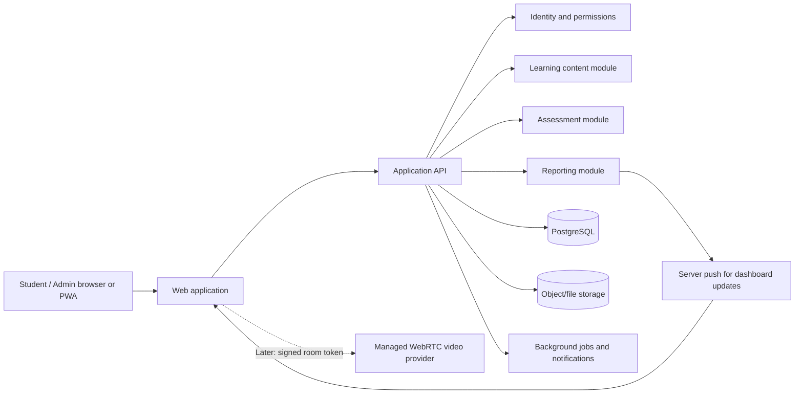

# CBC Learning Platform: Product Plan and Architecture

**Status:** Planning plus a working local student dashboard and backend MVP.
Production hosting, scaled database, safeguarding integrations, and live calls
have not been built.
**Purpose:** Define a practical first release and a path to grow it safely.

## 1. Product vision

Create a mobile-friendly learning platform for students following Kenya's CBC
curriculum. Learners can find learning materials, practise and sit examinations,
follow their progress, and revise together. Authorized administrators manage
learning content and assessments and oversee the service.

The platform should work well on commonly used phones and slower or unstable
internet connections. It should protect student information and make it clear
which users can see each kind of information.

### Roles

| Role | Main responsibilities |
| --- | --- |
| Student | Study, take assessments, view personal results, manage profile, and join permitted study groups |
| Owner/platform administrator | Manage users and platform settings; view aggregate activity, exam progress, and service health |

Use permissions rather than relying on hidden buttons: every protected action
must also be checked by the server.
Only students and authorized administrators receive platform accounts. School
staff may support learners outside the platform, but do not receive teacher
accounts or dashboards.

## 2. Student registration flow

Because many learners are children and may not have their own email address or
phone, do not make a student's personal email or phone the only way to register
or recover an account. The recommended first-release approach is school-invited
registration, with a guardian-assisted route for learners who are not joining
through a participating school.

### Route A: school-invited learner (recommended for the pilot)

1. A verified school administrator creates an invitation or imports
   a learner using only the approved minimum information.
2. The platform issues a one-time activation code/link with an expiry. A code
   should not by itself grant access to another learner's account or results.
3. The learner or guardian opens the invitation, confirms the school and
   learner details, and reads the privacy and acceptable-use information.
4. Where required by the agreed policy, a parent/guardian confirms consent
   through an adult contact channel. Verify that channel without requiring the
   learner to own a phone or email account.
5. The learner sets a username and password. Provide a safe recovery method
   through the guardian or school rather than exposing the learner's personal
   details.
6. The account becomes active and the learner sees the appropriate grade,
   subjects, and dashboard. Any school or grade correction can be routed
   through an authorized administrator.

### Route B: learner not joining through a school

1. The learner and parent/guardian choose learner registration and enter only
   required details, such as the learner's name, CBC grade/level, and a chosen
   username. School name can be optional unless needed for a service.
2. An adult provides a contact method for consent and account recovery, if
   required by the approved policy. Send a one-time verification code to that
   adult contact.
3. The adult reviews the privacy notice and confirms the required permissions;
   the learner sets their password after the adult step is complete.
4. The account is activated, or marked pending if a human/school verification
   step is required. The student dashboard opens once activation is complete.

### Registration safeguards and account lifecycle

- Keep platform account roles limited to student and administrator.
- Do not request a national identity number, exact birth date, or a student's
  personal phone number by default. Collect additional details only if there is
  a documented need and an approved privacy basis.
- Explain in age-appropriate language what information is collected, why it is
  used, and who can see it. Obtain appropriate consent before collecting or
  sharing a child's information; confirm the applicable Kenyan requirements
  with qualified guidance before launch.
- Use expiring, single-use invitations; rate-limit verification and recovery;
  do not reveal whether a username or phone number belongs to an account.
- Provide account states such as invited, awaiting guardian verification,
  active, suspended, and closed. Give the user a clear next step for any
  pending state.
- Allow learners to edit permitted profile fields. Changes that affect
  school/grade membership or account recovery should require verification or
  authorized approval.
- Do not launch student-to-student messaging or calls until room access,
  reporting, moderation, and safeguarding rules are ready.

This is a recommended product flow, not legal advice. The final consent and
verification steps depend on the platform's operating model and Kenyan
data-protection and child-safeguarding requirements.

## 3. Product principles

1. **Learning first:** study materials and assessments must remain usable even
   when live calls or analytics are unavailable.
2. **Save work reliably:** answer changes should be saved during an exam, and
   students should see whether their work has been saved.
3. **Privacy by default:** collect only needed information, show each student
   their own results, and restrict staff access by role.
4. **Scale based on evidence:** set load targets, test them, and increase
   capacity based on measured demand rather than promising unlimited use.
5. **Accessible and low-bandwidth:** design for phones, keyboard use, readable
   layouts, and unreliable connections.
6. **Transparent reporting:** define dashboard metrics and show when data was
   last updated.

## 4. Proposed first release (MVP)

### Include

- Registration/invitation, sign-in, password recovery, and role-based access.
- Student profile viewing and editing, with carefully limited profile fields.
- A Kenya CBC curriculum structure using the approved grade/level, learning
  area, strand, and topic labels for the selected launch grades.
- Learning materials: text, links, and common document formats, with file-size
  limits and safe upload handling.
- Question bank and exam-paper management, including draft/published status.
- Objective question types for automatic marking and a review queue for
  manually marked responses.
- Timed assessments, clear instructions, autosaving, reconnect handling,
  submission confirmation, and attempt history.
- Student dashboard: subjects, learning materials, upcoming/open assessments,
  in-progress attempts, submitted work, and released results.
- Owner dashboard: registered learners, recently active users, in-progress
  attempts, submitted/completed attempts, and basic subject-level summaries.
- Admin tools for user, subject, material, exam, and reporting management.
- Basic notifications (in-app and email where appropriate).
- Audit records for sensitive administrator actions and assessment events.

### Defer until the core workflows are proven

- Voice/video rooms and group chat.
- Parent/guardian accounts.
- Payments, certificates, leaderboards, and complex gamification.
- AI recommendations or automated high-stakes marking.
- Offline graded exams. Offline study-material access can be evaluated sooner;
  offline exams need explicit rules for timing, synchronization, and fairness.
- Advanced proctoring. Software cannot guarantee that a learner will not seek
  outside help; any monitoring needs a clear educational, privacy, and consent
  justification.

## 5. Main user journeys

### Student

1. Create or activate an account and complete only required profile details.
2. Open the dashboard and choose a subject/topic.
3. Read or download learning material.
4. Start an available assessment and see its time limit, rules, and save status.
5. Answer questions; the platform saves changes and recovers safely after a
   brief connection loss.
6. Submit once, receive confirmation, and later view results when released.
7. Review progress and find approved revision activities.

### Owner/platform administrator

1. Sign in with a protected administrator account.
2. See summary metrics with definitions and a "last updated" time.
3. Drill into operational details only when authorized and necessary.
4. Manage user access and platform content; sensitive actions are audited.
5. See service health and errors separately from learner-performance metrics.

## 6. Dashboard metric definitions

Agree on definitions before using metrics for decisions:

- **Registered learners:** accounts with the learner role, excluding deleted
  or disabled accounts as explicitly defined.
- **Recently active:** a signed-in learner with a qualifying request within a
  configurable recent window. Show the window in the dashboard.
- **Online now:** an estimate based on recent heartbeat/activity, not proof that
  a person is looking at a screen. Show the last refresh time.
- **In progress:** an assessment attempt started but not submitted or expired.
- **Submitted:** the learner submitted an attempt; marking may still be pending.
- **Completed:** define whether this means submitted, fully marked, or result
  released. Prefer separate counts for these distinct states.
- **Pass rate/average:** show the population and date range; do not mix
  unmarked work with final results.

Use aggregate summaries by default. Access to identifiable learner-level
details should be permission-controlled and recorded where appropriate.

## 7. Recommended architecture

Start with a **modular monolith**: one deployable backend organized into clear
modules, rather than a large collection of independently deployed services.
This keeps the first version easier to build and operate while allowing
high-demand components to be separated later if measurements justify it.

### Suggested technology direction

These are starting recommendations, not final commitments:

- **Web client:** TypeScript with a React-based framework such as Next.js;
  responsive web first, with the option to make it installable as a PWA.
- **Backend:** TypeScript API, either within the initial application or a
  NestJS service if a separately structured API is preferred. Keep business
  rules on the server.
- **Database:** managed PostgreSQL for accounts, curriculum, assessments,
  attempts, results, and audit records.
- **Files:** private object storage for documents and media, with short-lived
  authorized download links; do not store large files in the relational
  database.
- **Real-time updates:** server-sent events (SSE) for one-way dashboard
  updates; WebSockets when interactive chat/presence is introduced.
- **Background work:** a job queue for notifications, imports, and expensive
  report generation. Add Redis or a managed queue when there is a demonstrated
  need; do not add infrastructure solely for speculative scale.
- **Calls:** integrate a managed WebRTC provider or a properly operated SFU
  service. Issue short-lived room tokens from the backend. Avoid building a
  media network from scratch for the first release.
- **Hosting:** managed cloud application, managed database, object storage,
  backups, and a CDN where useful. Choose the provider after confirming region,
  data residency, support, and budget needs.

### Important module boundaries

- **Identity/access:** users, roles, account status, sessions, recovery.
- **Curriculum/content:** levels, subjects, topics, materials, publication.
- **Assessments:** question banks, papers, schedules, attempts, answers,
  marking, result release.
- **Collaboration (later):** groups, membership, chat, call-room permissions.
- **Reporting:** defined aggregates and exports, separated from exam-taking
  requests so expensive reports cannot slow submissions.
- **Administration/audit:** moderation, settings, action history, support tools.

## 8. Assessment reliability and data model outline

The initial relational model will likely include:

- `users`, `roles`, and role assignments.
- `learner_profiles` and, if needed, school/class membership.
- `subjects`, `topics`, and `learning_resources`.
- `questions`, `question_options`, and `marking_guides`.
- `assessments`, `assessment_questions`, and availability rules.
- `attempts`, `answers`, `marking_records`, and released results.
- `notifications` and `audit_events`.

Keep each learner's attempt and answers associated with that learner and a
specific published assessment version. Do not let editing a draft paper change
the questions or marks of attempts already in progress. Use database
transactions and idempotent submission handling so retries do not create
duplicate submissions or results.

For answer saving, design the API to safely accept retries and indicate the
last saved time/status. Define what happens at the time limit, during a
connection outage, on duplicate browser tabs, and when a student submits
simultaneously from more than one device before launch.

## 9. Capacity, performance, and availability

"As many students as possible" needs a measurable first target. For planning,
use this **provisional load-test target**, then confirm or replace it before
implementation:

- 1,000 concurrent signed-in users.
- 300 simultaneous assessment attempts, including autosaves and submissions.
- Dashboard updates visible within 10 seconds under normal operating load.
- No lost confirmed answers or duplicate submissions in retry/failure tests.

These are test objectives, not a guarantee of production capacity. Live video
capacity is separate and depends on call size, participant count, provider,
and available bandwidth.

Before launch:

- Run load tests that model realistic exam starts, autosaves, submissions, and
  dashboard reads at the same time.
- Measure response latency, error rates, database load, and recovery behavior.
- Establish backups and prove that a restore works.
- Add application error reporting, infrastructure monitoring, and alerts.
- Document maintenance, outage communication, and incident response.
- Increase capacity only after tests identify the relevant bottleneck.

## 10. Privacy, safeguarding, and security

Because learners may be minors, privacy and safeguarding need decisions before
accounts or calls are opened to the public. Confirm the platform's obligations
under applicable Kenyan data-protection and child-safeguarding requirements
with qualified guidance before launch.

Baseline controls:

- Collect the minimum personal information needed; document purpose and
  retention for each field.
- Use secure sign-in and recovery, least-privilege roles, and server-side
  authorization checks.
- Encrypt traffic; protect secrets; use managed backups and controlled access.
- Keep answer keys and unpublished assessments inaccessible to learners.
- Rate-limit sensitive endpoints and validate uploads and user input.
- Record significant administrative and assessment state changes without
  logging passwords, tokens, or unnecessary student content.
- Provide reporting/blocking and adult moderation controls before enabling
  student-to-student calls or messaging.
- Define consent, call-room access, reporting, retention, and recording policy.
  Do not enable recording by default.
- Provide account suspension, data correction/deletion processes, and a
  security incident response contact/process.

## 11. Delivery phases and exit criteria

### Phase 0 — Discovery and decisions

- Confirm the initial Kenyan CBC grades/learning areas, launch audience, and
  operating model (school invitations, guardian-assisted registration, or
  both).
- Interview a small number of students and administrators.
- Agree on exam rules, role permissions, privacy requirements, initial
  capacity target, and budget.
- Produce screen flows and a prototype for feedback.

**Exit:** stakeholders approve the MVP scope, metric definitions, and
architecture choices.

### Phase 1 — Foundation

- Accounts, access roles, profiles, curriculum structure, basic administration,
  monitoring, and deployment pipeline.

**Exit:** role boundaries are tested; administrators can manage accounts;
backup and restore are demonstrated.

### Phase 2 — Learning content

- Subject/topic pages, resource upload and access, student dashboard, and
  accessible mobile layouts.

**Exit:** a pilot learner can find and use approved materials on a phone and
  on a slower connection.

### Phase 3 — Assessments

- Question bank, paper creation, attempt lifecycle, autosaving, submission,
  automatic/manual marking, and result release.

**Exit:** tests prove answers survive retries and a simulated reconnect,
duplicate submission is safe, and published results are permission-protected.

### Phase 4 — Owner reporting and pilot

- Defined dashboard metrics, refresh indicators, class/subject summaries,
  audit review, and a limited student/admin pilot.

**Exit:** pilot users complete real workflows; metric counts reconcile to
underlying records; load tests meet the agreed target.

### Phase 5 — Collaboration and expansion

- Moderated study groups, chat, then managed voice/video rooms; expand subjects
  and institutions based on pilot feedback.

**Exit:** safeguarding rules, permissions, moderation, call limits, support
process, and video-provider costs are reviewed before opening access broadly.

## 12. Decisions to settle before development

1. Which Kenyan CBC grades/learning areas are in the first launch?
2. Will the pilot use school invitations only, guardian-assisted registration,
   or both?
3. Who can create and publish learning materials and exams?
4. Are exams practice-only, formal school assessments, or both?
5. What question types, marking rules, retake rules, and result-release rules
   are required at launch?
6. What initial concurrent-user and simultaneous-exam target should be tested?
7. Should live calls be one-to-one, small groups, or both, and who supervises
   student rooms?
8. What budget and preferred hosting/data region are available?
9. What personal data is genuinely necessary, and what consent/retention rules
   apply?
10. What does the owner need to see in detail, and which reports must remain
    aggregate?

## 13. Immediate next steps

1. Answer the decisions above, beginning with first grades and how learners
   will get accounts.
2. Validate the MVP workflows with a small group of intended users.
3. Agree on the first capacity target and operational budget.
4. Approve wireframes, permission rules, and assessment lifecycle.
5. Only then choose final providers and begin implementation.

This document is a starting blueprint. Provider selection, legal/privacy
requirements, and capacity targets must be confirmed for the intended launch
before the design is treated as final.

## 14. Current local implementation

The workspace now includes a local full-stack MVP foundation:

- React/Vite student sign-in and invitation registration.
- A Node API with hashed passwords, signed bearer sessions, role checks, and
  request validation.
- Email-based sign-in with required email verification, five-digit one-time
  codes that expire after 10 minutes, and rate-limited code resend/attempts.
- Password recovery through a one-hour, single-use reset link, session
  invalidation after password changes, and a security notification email.
- A persistent SQLite development database with sample CBC learning areas,
  lesson reading/completion, exam attempts, autosaved answers, and objective
  marking.
- Student registration requires a CBC grade; learners can edit their grade and
  display name in their profile. Each student account has a unique student code.
- Signed-in learners can look up another learner by exact student code for
  study-circle discovery. Lookup reveals only the learner's name and grade;
  group chat and calls remain disabled pending moderation and safeguarding.
- An owner dashboard with registered/recently-active learner counts,
  a searchable directory of all student accounts, assessment attempt totals,
  refresh, and single-use invitation-code creation. Directory access is
  administrator-only.
- Administrator tools for creating/editing text lessons and notes, and
  creating/editing objective assessments before the first attempt.
- Administrator PDF resource management with private local file storage,
  server-side PDF parsing, draft/publish/archive/delete actions, and an
  administrator audit trail. Students can search, preview, and download only
  published PDFs assigned to their own grade.

Start locally with Node.js 22.13 or newer:

1. Copy `.env.example` to `.env` and set a unique random `JWT_SECRET` of at
   least 32 characters. Keep `.env` private; it is ignored by git.
2. Run `npm install`.
3. Run `npm run db:seed-demo`; it prints the local demo learner email and a
   generated password. This is sample data, not a real student account.
4. Set `ADMIN_NAME`, `ADMIN_USERNAME`, `ADMIN_EMAIL`, and `ADMIN_PASSWORD` in
   the environment (passwords must be 6–72 characters; use a longer password
   for better security), then run
   `npm run admin:create`. The command creates or updates that administrator.
5. Run `npm run dev` (or `npm run dev:all`), then open
   `http://127.0.0.1:5173`. Both the UI and API start together, including when
   starting with `npm run dev:ui`, so sign-in and other API requests are
   available without starting a second terminal.
6. Sign in as the owner, create a learner invitation, then register a student
   with the one-time code.

### Hosting the frontend and API

The frontend can be built for static hosting, but the complete platform is not
a static website: authentication, student records, assessments, and PDF
resources require the Express API and persistent SQLite/file storage. GitHub
Pages and similar static hosts serve only the frontend; deploy the API
separately to a Node.js or Docker host with persistent storage.

For GitHub Pages:

1. Deploy the API using the `Dockerfile` (or `npm ci`, `npm run build`, and
   `npm start`) on a host that supports Node.js 22 and a persistent disk.
   Preserve `/data` between restarts if using the provided Docker image.
2. Configure the API's private environment: `JWT_SECRET` (at least 32 random
   characters), `WEB_ORIGINS` (the exact Pages origin, for example
   `https://OWNER.github.io`), `APP_URL` (the full Pages site URL, including
   the repository path for project pages), and persistent `DATABASE_PATH`
   and `RESOURCE_STORAGE_PATH` locations. Configure mail credentials if
   registration and recovery emails are needed.
3. In the GitHub repository, set the Actions variable `VITE_API_BASE_URL` to
   the API's public HTTPS origin, for example `https://api.example.com`.
   Enable GitHub Pages with **GitHub Actions** as its publishing source.
4. Push to `main` or `master`, or run the Pages workflow manually. It builds
   the correct root or project-page asset base and refuses to publish if the
   API URL is missing.

For other static hosts, build with `VITE_API_BASE_URL` set to the public HTTPS
API origin and `VITE_BASE_PATH` set to `/` for a domain root or the site's
subdirectory (including leading and trailing slashes). The API must allow the
exact frontend origin in `WEB_ORIGINS`. Do not place server secrets, mail
passwords, or database credentials in `VITE_*` variables; frontend build
variables are public. A static upload without a separately deployed API can
show the sign-in page but cannot authenticate or load protected data.

The local database is SQLite to make development self-contained. PDF resources
are stored outside the public web root under `RESOURCE_STORAGE_PATH` (default
`data/resources`), parsed for validity, and limited to 20 MB per file. No
malware-scanning service is configured locally. This local file storage is not
a substitute for private object storage, malware scanning, backups, and
recovery procedures in production. Configure `MAIL_HOST`, `MAIL_PORT`,
`MAIL_USER`, `MAIL_FROM`, and the private server-side `MAIL_PASSWORD` (a Gmail
App Password when using Gmail) before registration verification or recovery
emails can be delivered. Do not expose mail credentials in frontend variables.
The project does not yet provide guardian consent verification, exam-paper and
marking-scheme PDF workflows, offline exams, live chat/calls, or a production
deployment and monitoring setup. Do not use sample accounts or content for
real learners.
